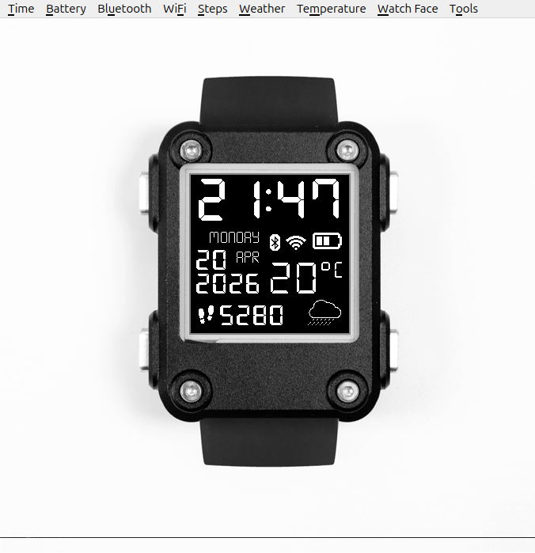

# watchysim-qt

A Linux / Qt6 port of [LeeHolmes/watchysim](https://github.com/LeeHolmes/watchysim) — a simulator for [Watchy](https://watchy.sqfmi.com/) e-paper watch faces. The upstream project is Windows-only (Win32 + GDI+); this fork replaces the platform layer with Qt6 so watch faces can be developed on Linux without the physical hardware.



## What's different from upstream

| | Upstream | This port |
|---|---|---|
| Platform | Windows (Visual Studio) | Linux (Qt6) |
| Display backend | GDI+ `Graphics`/`HDC` | 200×200 RGB framebuffer → `QImage` |
| Main loop | `wWinMain` + `WndProc` | `QApplication` event loop |
| Build | `WatchySim.sln` | `CMakeLists.txt` |
| Menus | Native Win32 | Native Qt `QMenuBar` (full parity) |
| Chassis background | `IDR_BACKGROUND` GIF resource | `QPixmap` loaded at runtime |

Watch face code, fonts, icons, and Bresenham drawing primitives are unchanged.

## Requirements

- CMake ≥ 3.16
- A C++17 compiler (gcc/clang)
- Qt6 (Widgets, Gui, Core)

On Debian/Ubuntu:

```
sudo apt install cmake build-essential qt6-base-dev
```

## Build & run

```
cmake -B build
cmake --build build -j
./build/watchysim
```

## Features

The menu bar reproduces the upstream state overrides:

- **Time** — current system time, two presets (short/long format), custom (`MM/DD/YYYY HH:MM`)
- **Battery** — Dead / Low / Medium / High / Max (0.0V – 4.2V)
- **Bluetooth** — On / Off
- **WiFi** — On / Off (also toggles external weather/temperature sourcing)
- **Steps** — 0 / 12 / 5280 / 52769
- **Weather** — 9 OpenWeather condition codes (clear → thunderstorm)
- **Temperature** — Celsius / Fahrenheit + 4 presets (-45, 7, 15, 40)
- **Watch Face** — live-swap between all 11 bundled faces
- **Tools** → **Screenshot...** — save the 200×200 e-paper area as PNG

Time advances with the system clock (minute resolution).

## Available watch faces

Under `WatchySim/WatchFaces/`: `7_SEG`, `AnalogGabel`, `DOS`, `DrawTest`, `MacPaint`, `Mario`, `Niobe`, `Pokemon`, `PowerShell`, `Scene`, `Tetris`. All are reachable from the **Watch Face** menu at runtime.

## Writing a new watch face

Same workflow as upstream — see the original [README's "Testing a Watch Face"](https://github.com/LeeHolmes/watchysim#testing-a-watch-face) section. Add a class extending `Watchy`, override `drawWatchFace()`, drop it in `WatchFaces/MyFace/`. CMake's glob picks up any `WatchFaces/*/*.cpp` on the next build. To surface the new face in the menu, add one `addFace(...)` line in `WatchySim/main_qt.cpp`.

## Porting notes

The main boundary crossed was `DisplaySim` (in `WatchySim/Watchy.h` / `Watchy.cpp`), which previously held `Gdiplus::Graphics*` and `HDC*` pointers. The port replaces these with an owned `uint8_t pixels[200*200*3]` RGB24 framebuffer. `drawPixel`/`drawLine`/`fillScreen` now write to the buffer directly (Bresenham for lines), and `main_qt.cpp` wraps that buffer in a `QImage` (`Format_RGB888`) composited over the Watchy chassis pixmap at offset (241, 198). A small `compat.h` shims MSVC-only `_itoa`/`_itoa_s`/`_ltoa`/`_ultoa` so `arduino/String.cpp` and a few watch faces compile unchanged. Two identical copies of `Px437_IBM_BIOS5pt7b.h` (one per DOS/PowerShell face) were given matching include guards so both face headers can coexist in the same translation unit.

## License

MIT, inherited from the upstream project. See [LICENSE](LICENSE).
